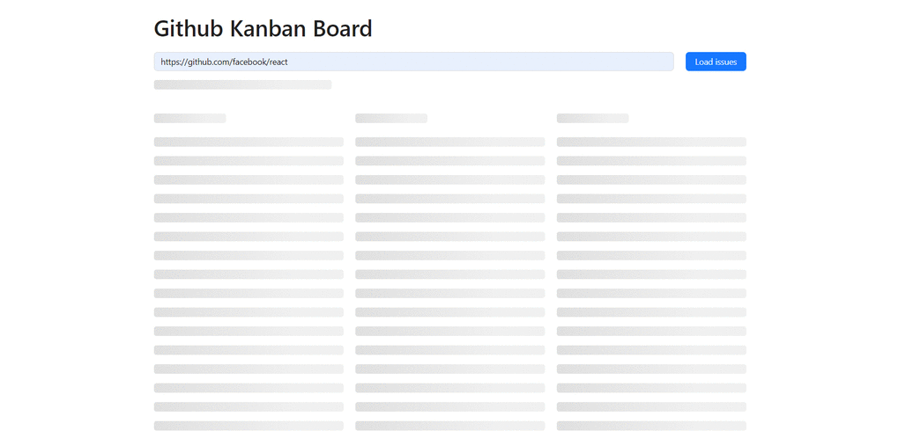

# Github Kanban Board

## Features

1. User should enter repo URL in the input on top of the page and press "Load". For example: `https://github.com/facebook/react`.
2. App loads issues for the repo using Github API.
3. App contains 3 columns:

- ToDo (all new issues)
- In Progress (opened issues with assignee)
- Done (closed issues)

4. User should be able to drag-n-drop between the columns and change the order of issues.
5. Current issue position (column and order) should be stored between search and browser sessions. When the user loads issues for Repo1 -> Repo2 -> Repo1 he should see all changes he did for Repo1.
6. User should be able to visit the profile of the owner of the repo and visit the repo as well by links under the input.

# [LIVE DEMO](https://vlkzmn.github.io/github_kanban_board/)

# Technologies used

<ul>
  <li>HTML</li>
  <li>CSS</li>
  <li>Ant Design</li>
  <li>React</li>
  <li>react-beautiful-dnd</li>
  <li>Redux Toolkit</li>
  <li>TypeScript</li>
  <li>RTK Query</li>
  <li>Vite</li>
  <li>Vitest</li>
  <li>Eslint</li>
  <li>Prettier</li>
  <li>Husky</li>
  <li>Lint-staged</li>
  <li>gh-pages</li>
</ul>

# Preview

# How to run the project locally

- Fork and clone this repository
- Run `npm install` in your terminal
- Run `npm run dev` in your terminal to start the project locally
- Run `npm test` in your terminal to start test

# Dependencies

- Node `v18+`
